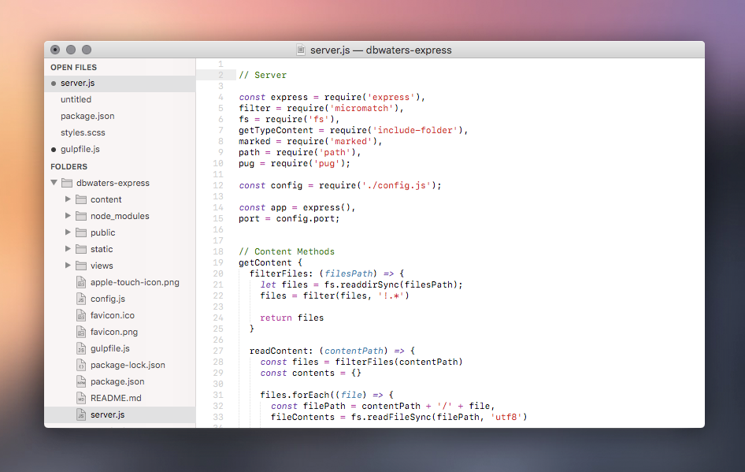
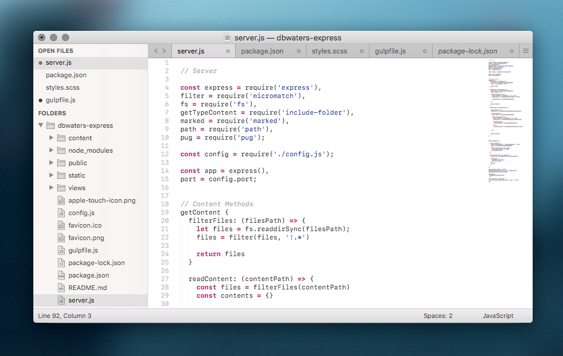
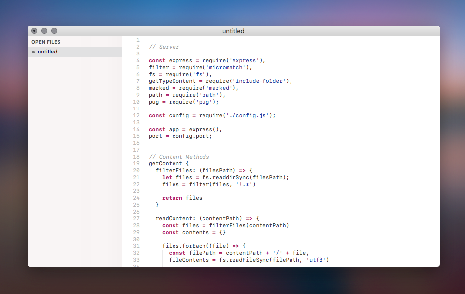

## Go Native

The color scheme in the first shot is 'Dawn'.  The last two use FauXcode, an included color scheme I made that matched the default Xcode theme.

## Note

This is my tweaked version of the [Sienna](https://github.com/johansatge/sienna) theme by [johansatge](https://github.com/johansatge).  All credits for the amazing base goes to him. I have added subtle tweaks and adjustments to colors, icons, padding, text, etc to (even more) closely match the latest version of OS X. 

Please report any issues you may have and I will work to resolve them.  Assets for retina are included, but I haven't tested it, so icons might look a little wonky. If so, let me know in an issue and I can adjust things.

## Installation

### Install with [Package Control](https://packagecontrol.io/)

* Open the `Command Palette` (<kbd>CMD</kbd>+<kbd>MAJ</kbd>+<kbd>P</kbd>)
* Select `Package Control: Install Package`
* Search `Theme - High-Sienna` and hit <kbd>Enter</kbd>

### Install manually

* [Download](https://github.com/johansatge/sienna/archive/master.zip) the latest version of the project
* Unzip it and rename the directory to `High-Sienna`
* Open your packages directory (`Sublime Text` → `Preferences` → `Browse Packages...`)
* Move the `High-Sienna` directory there

## Activation

* Open your settings (`Sublime Text` → `Preferences` → `Settings`)
* Replace the `theme` key with High-Sienna.sublime-theme

theme": "YourPreviousTheme.sublime-theme", 
"theme": "High-Sienna.sublime-theme",

Then, restart Sublime Text.

## Settings

The following parameters can be added in your settings file (`Sublime Text` → `Preferences` → `Settings`).

Set `sienna_system_font` to `true` to use the system font (if your system does not have the [San Francisco](https://developer.apple.com/fonts/) font installed, or if you experience UI issues.  

I also recommend setting the 'SF Mono' as your main font. [Here](http://osxdaily.com/2018/01/07/use-sf-mono-font-mac/) is how to install it.  Add `"font_face": "SF Mono",` to your settings file to enable it.  I suggest setting  `"font_size": 11,` also.

## Credits

This theme is based on the following awesome projects:

* [Sienna](https://github.com/johansatge/sienna) _(Based on)_
* [El Capitan Theme](https://github.com/iccir/El-Capitan-Theme) _(General inspiration, scrollbar & quick panel styles)_
* [Soda Theme](https://github.com/buymeasoda/soda-theme) _(Buttons style)_
* [A File Icon](https://github.com/ihodev/a-file-icon) _(Icons)_
* [DA UI](https://github.com/ihodev/sublime-da-ui) _(Icons)_
